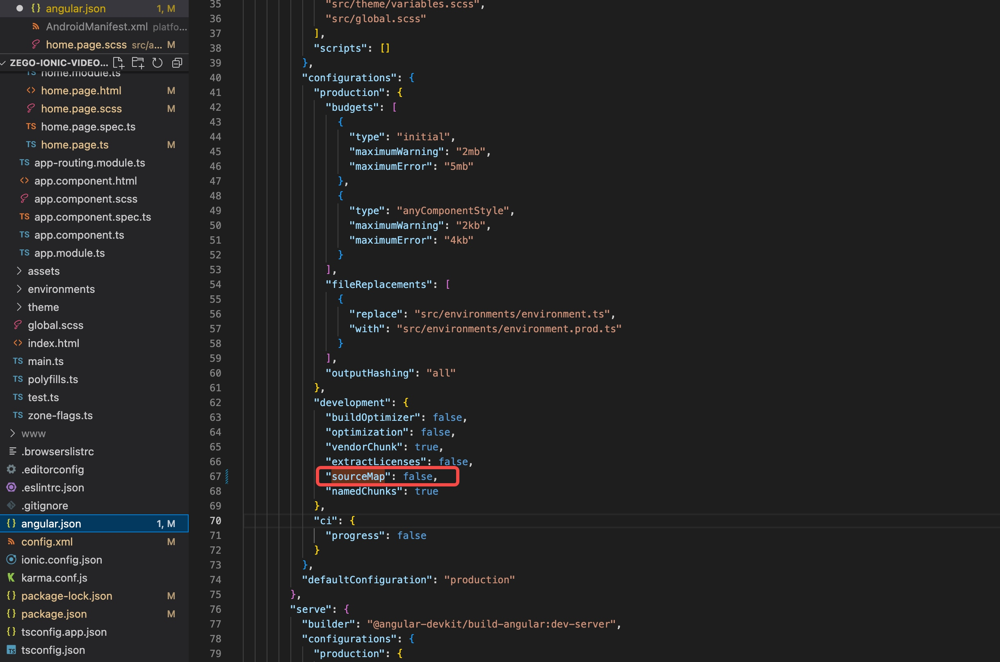
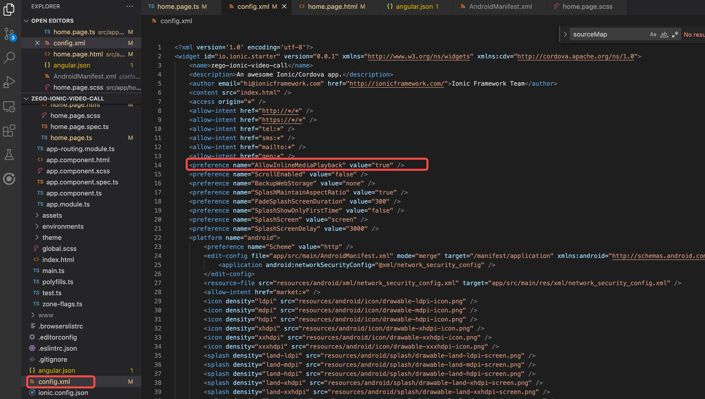
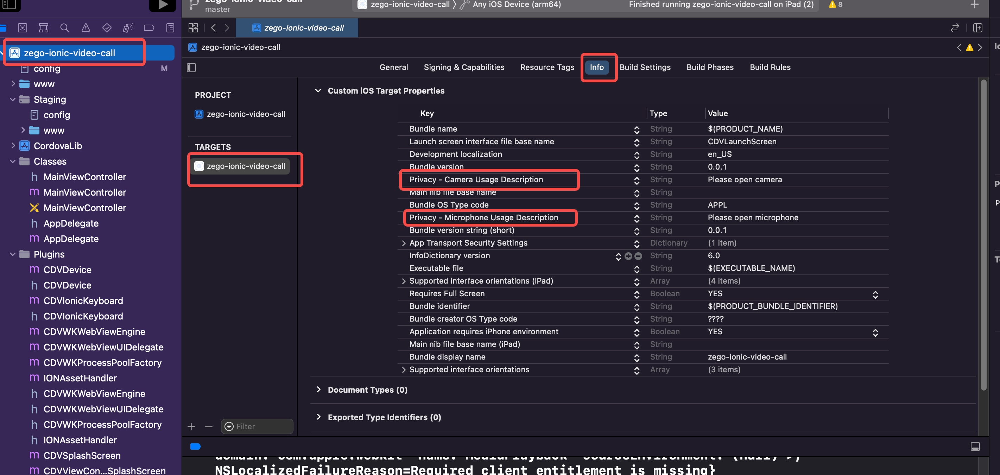
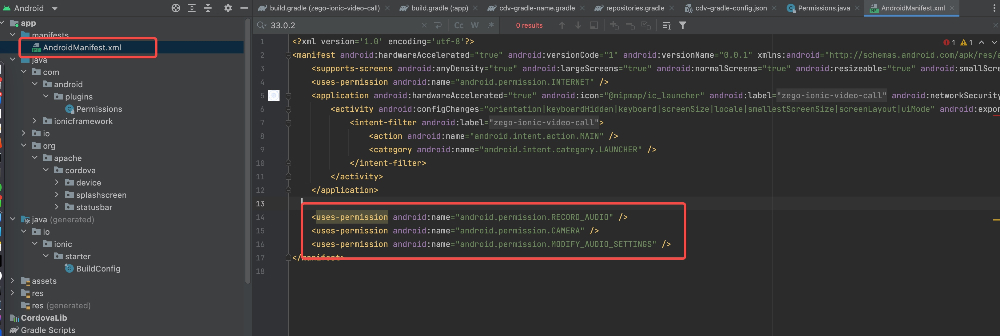
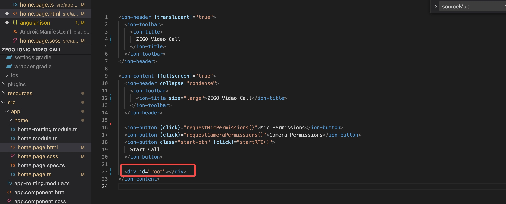
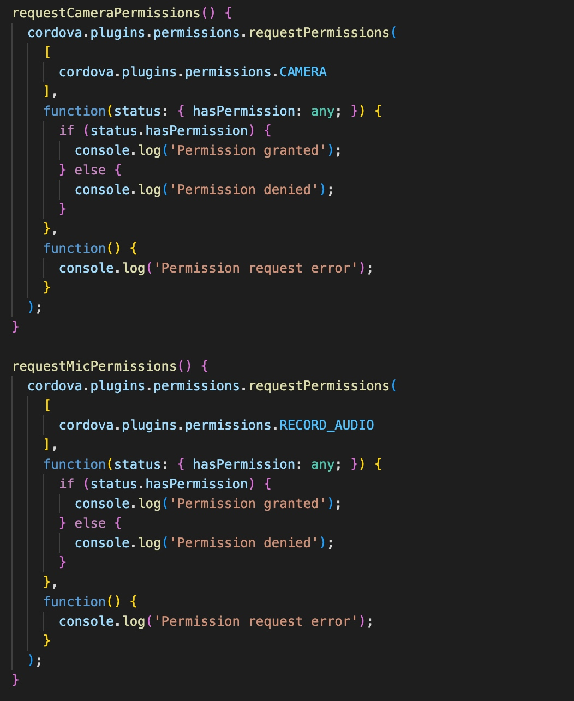
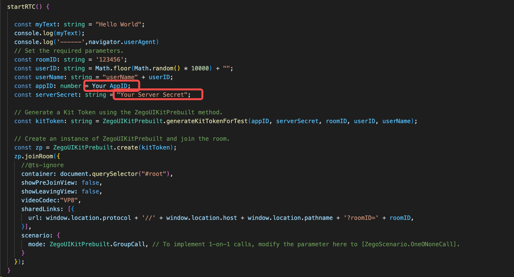

# README

## Project Configuration
### 1. Disable sourceMap



### 2. Set `AllowInlineMediaPlayback` property


### 3. Set iOS camera and microphone permissions



### 4. Set Android camera and microphone permissions


## Implement Video Call

### 1. Add a `div` module to the page where Video Call needs to be displayed.


### 2. Add permission request
- [Install `Android Permissions` plugin](https://danielsogl.gitbook.io/awesome-cordova-plugins/android-permissions#usage-documentation).
- Before initiating a call, we need to request camera and microphone permissions.


### 3. Add start call method
- Install the ZEGO UIKit package using the following command.
```
npm install @zegocloud/zego-uikit-prebuilt@latest
```

- Import ZEGO UIKit SDK

```
import { ZegoUIKitPrebuilt } from '@zegocloud/zego-uikit-prebuilt';
```

- Update AppID and Server Secret with the Token obtained from your business backend. For more details, please refer to the [reference documentation](https://docs.zegocloud.com/article/14741).


> For detailed usage instructions, please refer to the [official documentation](https://docs.zegocloud.com/article/15385).